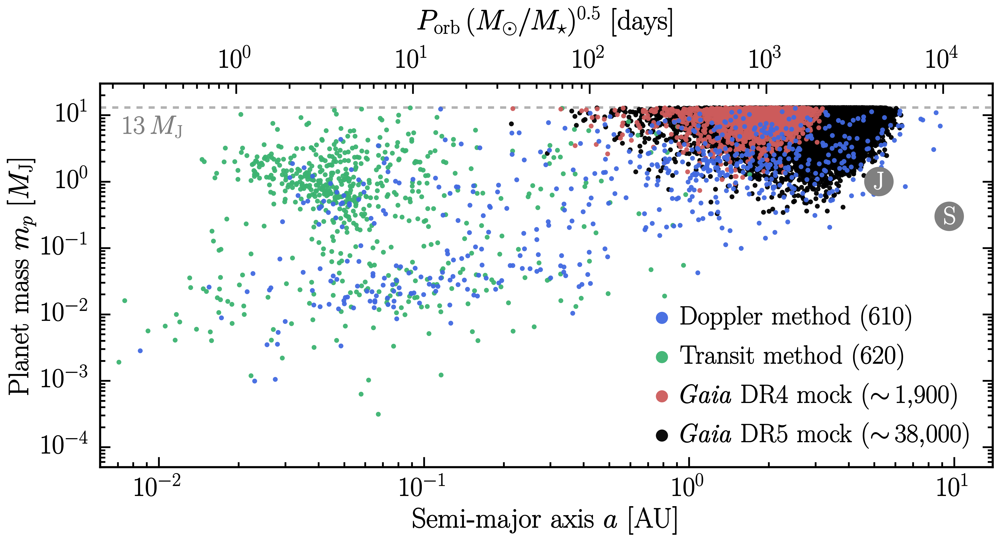

# [Gaia Exoplanet Forecasts](https://arxiv.org/abs/????.?????)
This repository contains code and supplementary material for the Gaia forecasts presented in Lammers & Winn submitted (https://arxiv.org/abs/????.?????). Scripts are included to reproduce our semi-analytical calculation, generate and fit simulated Gaia astrometry, and make the figures that appear in the paper.

# Mock DR4 & DR5 exoplanet catalogs
Our mock catalogs are included as '.csv' files and can be accessed using the code below.

The stars in the mock catalog are real Gaia sources, so any desired parameters that were not included in the catalog can be retrieved using the Gaia source IDs.

# Creating custom mock catalogs
The orbit fits for all planets are included as '.csv' files so that users can create mock catalogs with different detection criteria. The code below illustrates how to load the orbit fits and apply the detection criteria used to make our fiducial catalogs.

# Contact
Feel free to contact me at caleb [dot] lammers [at] princeton [dot] edu if you have questions/comments.
